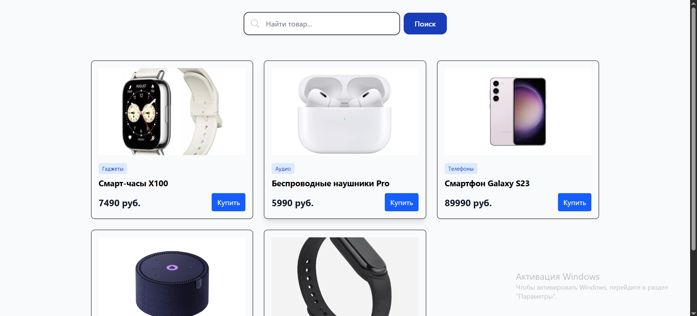
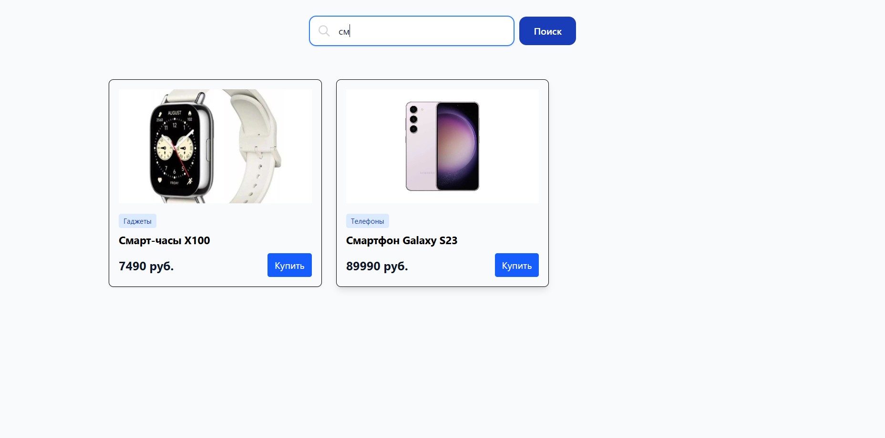
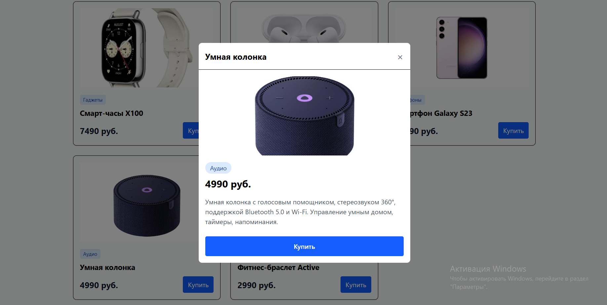
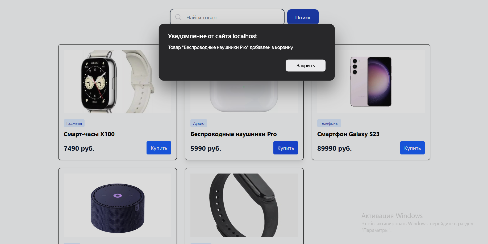

# Test task. Creating a product catalog

## Table of contents

- [Overview](#overview)
  - [The challenge](#the-challenge)
  - [Screenshot](#screenshot)
  - [Links](#links)
- [My process](#my-process)
  - [Built with](#built-with)

## Overview

### The challenge

Create a small one-page application that displays a list of products and allows to filter them by name and view detailed information about the selected product in a modal window.  
What should work:  
• The main page displays product cards (image, name, price).  
• Search is a text field that filters products by name on the fly.  
• Modal window - when clicking on the card, a pop-up window opens with full information about the product (large image, description, price, "Buy" button). The window is closed by pressing the "X" button, clicking outside the window, and pressing Esc.  
• API request - product data is taken from a simulated endpoint. Example of the structure:  

```json
[
    {
        "id": 1,
        "title": "Smart watch X100",
        "price": 7490,
        "category": "Gadgets",
        "image": " https://example.com/img/1.jpg ",
        "description": "Waterproof, GPS, 7-day battery"
    }
]
```  
• Adaptability - The layout should look correct on mobile (< 480 pixels), tablets (< 768 pixels), and desktops.  
• Git - all the code is in the repository, at least 3 commits.  

### Screenshot






### Links

- Live Site URL: [catalog]()

## My process

### Built with

- React
- Tailwind CSS